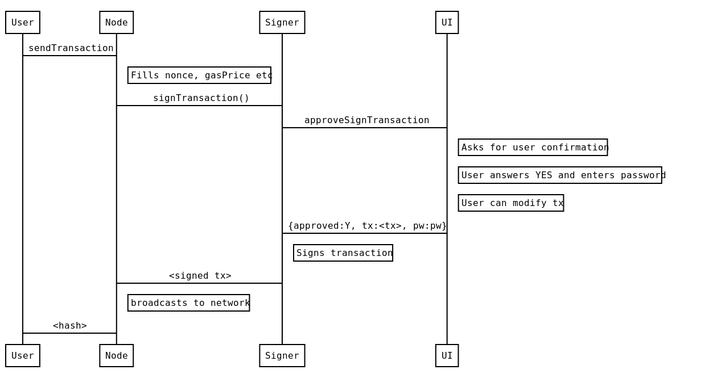
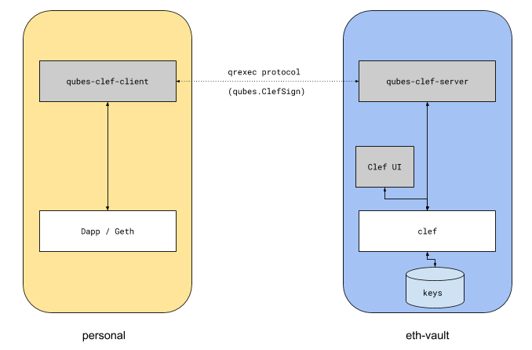
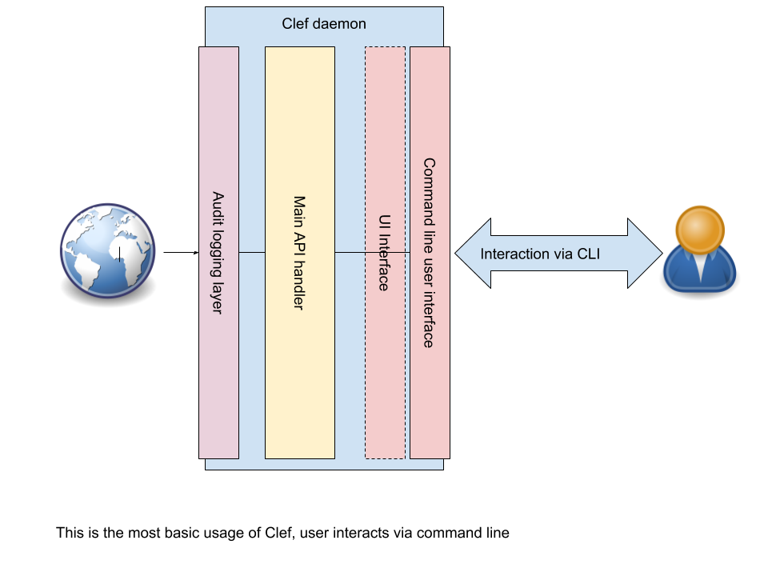
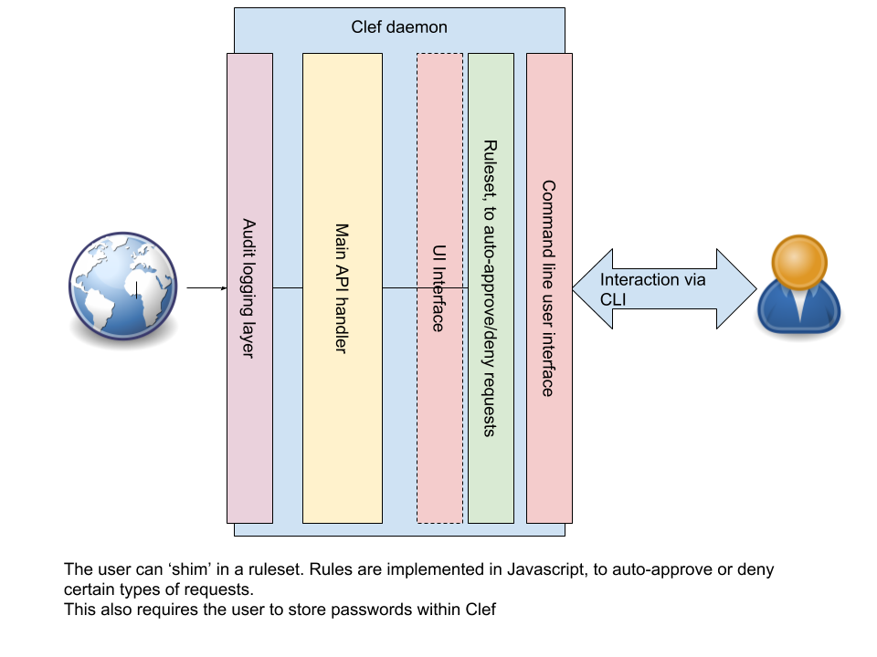
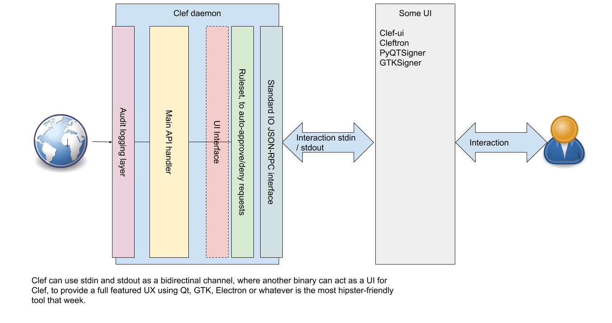
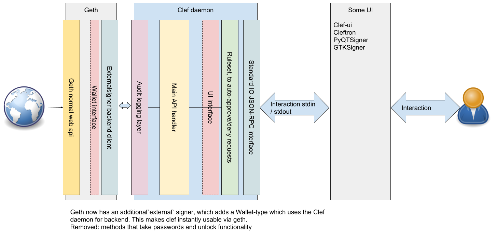

Clef
===
_A reasonably secure wallet_

Goal: Accommodate arbitrary high requirements for security (through _isolation_ and _separation_), while still providing _usability_.

Clef can be used to sign transactions and data and is meant as a replacement for geth's account management.
This allows DApps not to depend on geth's account management. When a DApp wants to sign data it can send the data to
the signer, the signer will then provide the user with context and asks the user for permission to sign the data. If
the users grants the signing request the signer will send the signature back to the DApp.
  
This setup allows a DApp to connect to a remote Ethereum node and send transactions that are locally signed. This can
help in situations when a DApp is connected to a remote node because a local Ethereum node is not available, not
synchronised with the chain or a particular Ethereum node that has no built-in (or limited) account management.
  
Clef can run as a daemon on the same machine, or off a usb-stick like [usb armory](https://inversepath.com/usbarmory),
or a separate VM in a [QubesOS](https://www.qubes-os.org/) type os setup.


## More info

Check out 

* the [tutorial](Tutorial.md) for some concrete examples on how the signer works.
* the [setup docs](Setup.md) for some information on how to configure it to work on QubesOS or USBArmory. 
* more info about [rules](Rules.md)
* the [data types](datatypes.md) for detailed information on the json types used in the communication between
  clef and an external UI 

## Security model

The security model of the signer is as follows:

* One critical binary is responsible for all cryptographic ops.
* The signer has a well-defined 'external' API - **UNTRUSTED**.
* The signer also has bidirectional APIs with whoever invoked it, via stdin/stdout -- considered **TRUSTED**.
    * `clef` exposes API for the UI to consume,
    * `ui` exposes API for `clef` to consume


The basic premise being, 

* A small(ish) binary without dependencies, 
* that is deployed on a trusted (secure) machine, 
* which serves untrusted requests, 
* in a hostile (network) environment


The general flow for signing a transaction using e.g. geth is as follows:




Clef relies on __sign-what-you-see__. To provide as much context as possible, 

- It parses calldata against 4byte database of method signatures. 
- It alerts the user about the origin of the request (ip, `user-agent`,`transport`, `Origin`)


# Setup scenarios

One setup scenario is to use virtualization, e.g. within QubesOS, where to 
Clef is deployed on a non-networked machine (`ethvault` below)




Another option is to deploy Clef on a separate physical device, e.g. USB Armory, 
and access the CLI-UI via SSH on the interface provided by the USB ethernet 
adapter, and expose HTTP interface via tunneling. 


## Multi-user setup

Clef can also be used in a situation where several people need to make transactions, 
and some other person (finance) does approval. 


## Architecture

Clef is divided into two parts

- Clef
- UI

Clef has a CLI natively, but a more refined UI can start `clef` in _standard-input-output-IO mode_.

---

Clef _native_ CLI user interface example:
```
--------- Transaction request-------------
to:    0x8A8eAFb1cf62BfBeb1741769DAE1a9dd47996192
from:     0x8A8eAFb1cf62BfBeb1741769DAE1a9dd47996192 [chksum ok]
value:    1 wei
gas:      0x1 (1)
gasprice: 1 wei
nonce:    0x1 (1)

Request context:
	127.0.0.1:59870 -> HTTP/1.1 -> localhost:8550

Additional HTTP header data, provided by the external caller:
	User-Agent: Go-http-client/1.1
	Origin: 
-------------------------------------------
Approve? [y/N]:
> y
Enter password to approve:
```

`clef` will invoke API-methods on the UI whenever an action is required. 

- `ui_ApproveTx`
- `ui_ApproveListing`
- ...

This is called the `internal api`, or `ui-api`. 





### Rules

Historically, a user who wanted an easy way to sign transactions repeatedly, would
use some variant of `personal.unlock`. That is a very insecure way of managing 
accounts, and is not present in Clef. Clef instead implements Rules, which can 
be customized to provide the same type of ease of use, but with much higher
security-guarantees. 

Examples of rules:

* "I want to allow transactions with contract `CasinoDapp`, with up to `0.05 ether` in value to maximum `1 ether` per 24h period"
* "I want to allow transaction to contract `EthAlarmClock` with `data`=`0xdeadbeef`, if `value=0`, `gas < 44k` and `gasPrice < 40Gwei`"

Clef comes with a Javascript VM which can evaluate a ruleset file. The ruleset
file has access to the same interface that an external UI would have. 

#### Example 1: Allow listing

```javascript
    function ApproveListing(){
        return "Approve"
    }
```

---

#### Example 2: Allow destination

```javascript
function ApproveTx(r){
        var ok = "0x0000000000000000000000000000000000001337";
        var nope = "0x000000000000000000000000000000000000dead";
        if(r.transaction.from.toLowerCase()== ok){ 
            return "Approve"
        }
        if(r.transaction.from.toLowerCase()==nope){ 
            return "Reject"
        }
	// Otherwise goes to manual processing
}
```

---

#### Example 3: a rate-limited window


```javascript
	function big(str){
		if(str.slice(0,2) == "0x"){ return new BigNumber(str.slice(2),16)}
		return new BigNumber(str)
	}

	// Time window: 1 week
	var window = 1000* 3600*24*7;
	// Limit : 1 ether
	var limit = new BigNumber("1e18");
    
	function isLimitOk(transaction){
		var value = big(transaction.value)
		// Start of our window function
		var windowstart = new Date().getTime() - window;

		var txs = [];
		var stored = storage.Get('txs');

		if(stored != ""){
			txs = JSON.parse(stored)
		}
		// First, remove all that have passed out of the time-window
		var newtxs = txs.filter(function(tx){return tx.tstamp > windowstart});
		console.log(txs, newtxs.length);
		// Secondly, aggregate the current sum
		sum = new BigNumber(0)
		sum = newtxs.reduce(function(agg, tx){ return big(tx.value).plus(agg)}, sum);
		// Would we exceed weekly limit ?
		return sum.plus(value).lt(limit)

	}
	function ApproveTx(r){
		if (isLimitOk(r.transaction)){
			return "Approve"
		}
		return "Nope"
	}

	/**
	* OnApprovedTx(str) is called when a transaction has been approved and signed. 
	*/
 	function OnApprovedTx(resp){
		var value = big(resp.tx.value)
		var txs = []
		// Load stored transactions
		var stored = storage.Get('txs');
		if(stored != ""){
			txs = JSON.parse(stored)
		}
		// Add this to the storage
		txs.push({tstamp: new Date().getTime(), value: value});
		storage.Put("txs", JSON.stringify(txs));
	}

```

### A note about passwords...

In normal mode, passwords are supplied via UI. 
In order to use rules, keystore passwords must be stored in `clef`. Clef uses an encrypted container to store 

- Keystore passwords
- SHA256 hash of ruleset file
- Key/value pairs accessible to the Javascript ruleset implementation
  - This, in turn, enables the ruleset files to save data and thus implement
  things like the rate-limited window.
  
---
## External UIs

The `clef` daemon can be wrapped by an external process, which can then take
the part of a UI. 


QT UI on Ubuntu


GTK UI on Qubes


### Rules for UI apis

A UI should conform to the following rules.

* A UI MUST NOT load any external resources that were not embedded/part of the UI package.
  * For example, not load icons, stylesheets from the internet
  * Not load files from the filesystem, unless they reside in the same local directory (e.g. config files)
* A Graphical UI MUST show the blocky-identicon for ethereum addresses.
* A UI MUST warn display approproate warning if the destination-account is formatted with invalid checksum.
* A UI MUST NOT open any ports or services
  * The signer opens the public port
* A UI SHOULD verify the permissions on the signer binary, and refuse to execute or warn if permissions allow non-user write.
* A UI SHOULD inform the user about the `SHA256` or `MD5` hash of the binary being executed
* A UI SHOULD NOT maintain a secondary storage of data, e.g. list of accounts
  * The signer provides accounts
* A UI SHOULD, to the best extent possible, use static linking / bundling, so that required libraries are bundled
along with the UI.


### UI Implementations 

There are a couple of implementation for a UI. We'll try to keep this list up to date. Currently, none of these are finished. 

| Name | Repo | UI type| No external resources| Blocky support| Verifies permissions | Hash information | No secondary storage | Statically linked| Can modify parameters|
| ---- | ---- | -------| ---- | ---- | ---- |---- | ---- | ---- | ---- |
| QtSigner| https://github.com/holiman/qtsigner/| Python3/QT-based| :+1:| :+1:| :+1:| :+1:| :+1:| :x: |  :+1: (partially)|
| GtkSigner| https://github.com/holiman/gtksigner| Python3/GTK-based| :+1:| :x:| :x:| :+1:| :+1:| :x: |  :x: |
| Frame | https://github.com/floating/frame/commits/go-signer| Electron-based| :x:| :x:| :x:| :x:| ?| :x: |  :x: |
| Clef UI| https://github.com/ethereum/clef-ui| Golang/QT-based| :+1:| :+1:| :x:| :+1:| :+1:| :x: |  :+1: (approve tx only)|


## Geth integration

The `--signer` CLI option for `geth` means that `geth` can use `clef` as a 
backend signer. 

Although some things, like `personal.unlock` disappears, `clef` has otherwise
a corresponding (or exceeding) feature set:

* Full set of options for hardware interaction (derivation etc) via UI
* EIP 191/712 - signing typed data

Clef can even sign Clique headers in a private network



